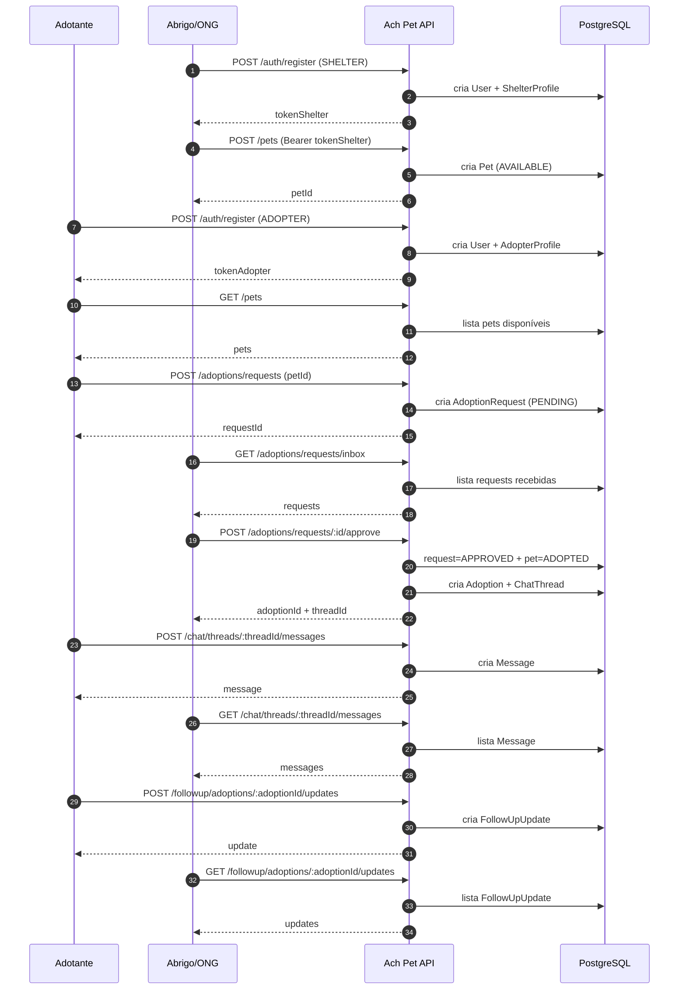

# Fluxo do Negócio — Ach Pet

Diagrama do fluxo principal do sistema (para apresentação/relatório).

```mermaid
sequenceDiagram
  autonumber
  participant A as Adotante
  participant S as Abrigo/ONG
  participant API as Ach Pet API
  participant DB as PostgreSQL

  %% Pets
  S->>API: POST /auth/register (SHELTER)
  API->>DB: cria User + ShelterProfile
  API-->>S: tokenShelter

  S->>API: POST /pets (Bearer tokenShelter)
  API->>DB: cria Pet (AVAILABLE)
  API-->>S: petId

  %% Adotante
  A->>API: POST /auth/register (ADOPTER)
  API->>DB: cria User + AdopterProfile
  API-->>A: tokenAdopter

  A->>API: GET /pets
  API->>DB: lista pets disponíveis
  API-->>A: pets

  %% Solicitação
  A->>API: POST /adoptions/requests (petId)
  API->>DB: cria AdoptionRequest (PENDING)
  API-->>A: requestId

  S->>API: GET /adoptions/requests/inbox
  API->>DB: lista requests recebidas
  API-->>S: requests

  %% Aprovação (gera adoção + thread)
  S->>API: POST /adoptions/requests/:id/approve
  API->>DB: request=APPROVED + pet=ADOPTED
  API->>DB: cria Adoption + ChatThread
  API-->>S: adoptionId + threadId

  %% Chat (após aprovação)
  A->>API: POST /chat/threads/:threadId/messages
  API->>DB: cria Message
  API-->>A: message

  S->>API: GET /chat/threads/:threadId/messages
  API->>DB: lista Message
  API-->>S: messages

  %% Acompanhamento pós-adoção
  A->>API: POST /followup/adoptions/:adoptionId/updates
  API->>DB: cria FollowUpUpdate
  API-->>A: update

  S->>API: GET /followup/adoptions/:adoptionId/updates
  API->>DB: lista FollowUpUpdate
  API-->>S: updates
```
